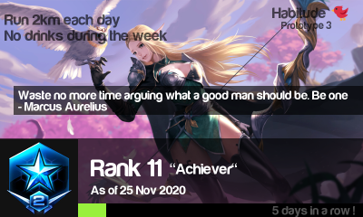

## Habitude

A gamified "progress tracker" widget for your habits or anything you want to do daily !

**Prototype-Pre-alpha-here-be-dragons edition** : Still figuring ideas, not much set in stone (such as life !) :)

## What's in the boooox ?

Creating habits is hard, gamification can help and there's successfull examples of that (Habitica, running apps, ...)

I wanted to have a simple widget to keep track of some habits and how well I am progressing in following them so I started to build one

It's pretty flexible, it just shows data after all but in a nice way

## Features

- Progress bar (100% = 60 days so stick to it !)
- Ranks icons (partial) & titles (at your discretion)
- Shiny UI 
✨
## Usage

- Create a folder to host the assets by downloading the repo via https://github.com/Myu-Unix/habitude/archive/main.zip
- Download the executable at https://github.com/Myu-Unix/habitude/releases

    ./habitude

Press 'K' to exit

#### Windows

    habitude.exe

Press 'K' to exit

#### Config file format

You need to have a file called **config.json** with this format in the **same folder** you run habitude

	{
	  "Description1": "20 Squats + 12 Push-ups",
	  "Description2": "No pecking your nose",
	  "Quote": "Waste no more time arguing what a good man should be. Be one",
	  "QuoteAuthor":"- Marcus Aurelius",
	  "DaysCounter": 2,
	  "RankTitle": "\"Super Hero Cadet\"",
	  "Updated": "As of 19 Nov 2020"
	}

By modifiying the value of DaysCounter, habitude will react and show different icons and fill the progress bar.

The max value for DaysCounter is 60.

#### Background image

Put a file named background.png in the folder where you run habitude, ideally 800x450

#### Sidenote : Compile for Windows

    GOOS=windows GOARCH=amd64 go build

#### Sidenote : Artwork

- Credits goes to Square Enix for Final Fantasy XV Pocket Edition
- Credits goes to Blizzard for Starcraft Icons

Don't sue me okay ? :D